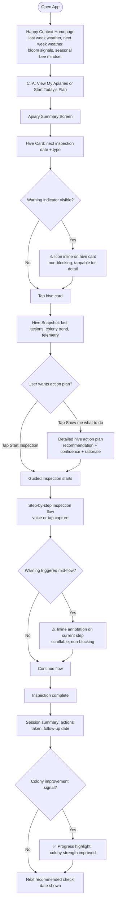
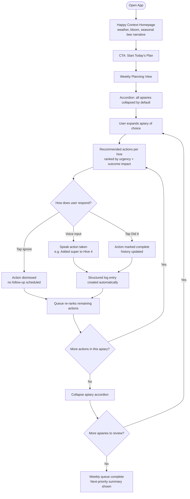
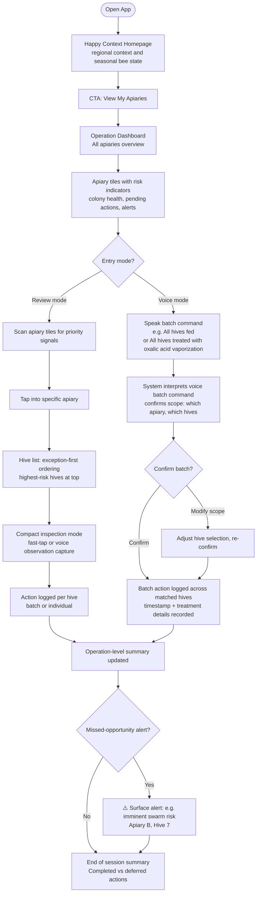
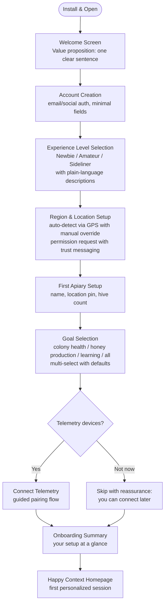

stepsCompleted: [1, 2, 3, 4, 5, 6, 7, 8, 9, 10, 11, 12, 13, 14]
inputDocuments:
  - /workspaces/bmad-method/_bmad-output/planning-artifacts/product-brief-bmad-method-2026-03-15.md
  - /workspaces/bmad-method/_bmad-output/planning-artifacts/prd.md
  - /workspaces/bmad-method/_bmad-output/planning-artifacts/research/domain-beekeeping-research-2026-03-15.md
  - /workspaces/bmad-method/_bmad-output/planning-artifacts/research/market-beekeeping-app-improve-outcomes-research-2026-03-15.md
  - /workspaces/bmad-method/_bmad-output/brainstorming/brainstorming-session-2026-03-14-134719.md
workflowType: ux-design
projectName: bmad-method
author: Humans
date: 2026-03-15
lastStep: 14
workflow_completed: true
---

# UX Design Specification bmad-method

**Author:** Humans
**Date:** 2026-03-15

---

<!-- UX design content will be appended sequentially through collaborative workflow steps -->

## Executive Summary

### Project Vision

bmad-method is a field-first mobile UX that helps beekeepers make the right decision at the right moment with confidence. The experience transforms ambiguity into clear, context-aware next steps by combining local seasonal context, user history, and explainable recommendations. The product vision is to improve real-world outcomes—colony health, survivability, and operational consistency—through trustworthy, low-friction decision support.

### Target Users

The primary audience is Newbie beekeepers who need confidence, interpretation, and guided action during inspections. Secondary audiences include Amateur beekeepers managing multiple priorities and Sideliners running larger, multi-location operations where efficiency and missed-opportunity prevention are critical. UX depth should adapt by skill level: narrated guidance for beginners, concise decision support for intermediates, and exception-first flows for advanced users.

### Key Design Challenges

The first challenge is trust: recommendations must be explainable, confidence-scored, and localized, or users will disengage. The second challenge is field practicality: inspections are time-constrained, hands-busy, and sometimes offline, so interactions must be fast, voice-forward, and resilient. The third challenge is scale complexity: the product must support multi-hive and multi-location planning without overwhelming users.

### Design Opportunities

A major opportunity is a confidence-first recommendation pattern that becomes a clear competitive differentiator. Another is a unified operating rhythm that links seasonal planning, in-inspection guidance, and structured logging into one continuous workflow. A third is skill-adaptive presentation that serves Newbies, Amateurs, and Sideliners from one core decision engine while tailoring depth and interaction style.

## Core User Experience

### Defining Experience

The core experience of bmad-method is a guided inspection loop that starts with immediate context and ends with confident action. Users open the app in the field, see a concise snapshot of prior notes, recent actions, and telemetry signals, then receive a recommendation for the inspection type they should run now. During inspection, the system continuously translates observations into actionable next steps with clear rationale and low-friction execution.

### Platform Strategy

The product is mobile-first on iOS and Android, optimized for touch-based, in-field use where time and attention are limited. A secondary web experience supports planning, admin, and reporting workflows outside the hive. Core inspection and logging flows must work offline and synchronize safely once connectivity returns, ensuring reliability in rural or unstable network environments.

### Effortless Interactions

Voice logging, guided inspection branching, weekly action prioritization, and contextual alerts should all feel effortless. The app should automatically summarize recent history and telemetry at inspection start, recommend the most relevant inspection pathway, and re-prioritize follow-up tasks based on what is observed. Users should spend energy on hive decisions, not data entry or navigation.

### Critical Success Moments

The strongest success moment is when a user starts an inspection and instantly receives a high-signal summary of prior notes, recent actions, and telemetry that points to the right inspection type. This creates immediate confidence and demonstrates that the app understands the hive context. The key failure moment is any session where the app cannot provide actionable guidance or cannot surface prior logs/history needed for decision quality.

### Experience Principles

- Context before action: always surface the minimum high-value context before asking users to choose.
- Guidance must be actionable: recommendations should end in a clear next step, not interpretation burden.
- Field speed over feature density: optimize for fast, resilient flows in hands-busy, time-constrained environments.
- Memory builds trust: preserve and reuse prior notes/actions as a first-class decision input.
- Effortless by default: automate ranking, summarization, and branching so users do less manual orchestration.

## Desired Emotional Response

### Primary Emotional Goals

The primary emotional goal of bmad-method is to make users feel safe and confident. The experience should reduce the fear of making preventable mistakes and replace hesitation with clear, supported decision-making. Users should feel that the product helps them protect hive health and act with greater certainty in moments that would otherwise feel ambiguous or high-risk.

### Emotional Journey Mapping

| Stage | Target Emotion | Design Mechanism | Measurement Signal |
|---|---|---|---|
| Discovery | Curiosity, not overwhelm | App store assets show real inspection scenarios, not feature lists. Onboarding starts with "What kind of beekeeper are you?" not "Create account." | Install-to-onboarding-complete rate |
| First Use | Relief, feeling supported | First homepage shows personalized context immediately after onboarding. First inspection recommendation appears within 30 seconds of reaching homepage. | Time to first recommendation view |
| Core Workflow | Guided, steady, helped | Recommendations always lead with action, never raw data. Confidence labels prevent second-guessing. Non-blocking warnings avoid panic. | Recommendation acceptance rate; inspection completion rate |
| Task Complete | Pride, accomplishment | Session summary highlights what was done well. ColonyImprovementSignal shows positive trends. Language: "Nice work" not "Task complete." | Post-session satisfaction (in-app micro-survey) |
| Return Visit | Excitement, progress | Homepage shows "Since your last visit" delta. Skill progression milestone progress is visible. Week-over-week improvement signals appear. | Return visit rate; time between sessions |
| Inactivity | Welcome, not guilt | Re-engagement uses "Here's what matters now" framing. No shame language about missed inspections. | Reactivation rate after 7+ day gap |

### Micro-Emotions

The most important micro-emotions for this product are confidence over confusion, trust over skepticism, calm over anxiety, accomplishment over frustration, and pride over self-doubt. In moments where hive health is uncertain, the product should also create hope instead of dread by showing that there is still a sensible next step.

### Design Implications

Safety should be supported through calm language, clear next actions, and visible fallback options when confidence is limited. Confidence should be built through transparent reasoning, local context, and explainable recommendations. Joy should emerge from progress, successful interventions, and healthier outcomes rather than decorative delight alone. Alerts should make consequences visible, especially when poor hive health or ignored warnings increase risk, but the tone should remain constructive and recovery-oriented rather than punishing. The design must help users move quickly from uncertainty to useful action.

### Emotional Design Principles

- Reduce fear before introducing complexity.
- Make the product feel protective, not controlling.
- Build confidence through clarity and evidence.
- Treat mistakes and missed signals as recoverable.
- Reward responsible action with pride and visible progress.
- Maintain a calm, competent tone in high-stakes moments.

## UX Pattern Analysis & Inspiration

### Inspiring Products Analysis

Broodminder is strong at turning hive telemetry into practical monitoring visibility. Its core value is that beekeepers can repeatedly check hive state and receive meaningful alerts, including swarm-related signals. This creates a habitual check-in loop grounded in operational relevance.

Facebook, specifically beekeeping communities, is strong at rapid situational advice exchange through photos, videos, and discussion. Users return because they can present a real scenario and get feedback quickly from many voices. The key UX strength is immediacy and social accessibility, though trust quality can vary.

Scientific Beekeeping is strong at structured, high-depth, evidence-informed educational content. Users return because the guidance feels rigorous, proven, and worth studying. The UX value is not speed but confidence through depth and clarity.

### Transferable UX Patterns

- Telemetry-first visibility: show per-apiary and per-hive status in a clear hierarchy so users can quickly locate where attention is needed.
- Alert-to-action flow: when risk appears, such as swarm-related signals, immediately pair the alert with recommended next steps and rationale.
- Mixed note capture model: support both structured and unstructured notes per hive and apiary to preserve operational consistency while allowing nuance.
- Trusted interpretation layer: provide expert-backed explanation for observations and recommendations to reduce ambiguity and anxiety.
- Rich context support: allow photo and video-linked guidance paths so users can get interpretation for what they actually see in the field.
- Structured learning depth: offer deeper why and evidence paths for users who want rigorous understanding behind recommendations.

### Anti-Patterns to Avoid

- Data without direction: showing telemetry or alerts without clear next actions increases anxiety.
- Unverified advice streams: community-like input without trust markers can create confusion and unsafe decisions.
- Overly dense expert content in core workflows: high-detail educational material should not block fast in-field decisions.
- Flat information architecture: failing to separate operation-level, apiary-level, and hive-level context causes overload.
- Generic recommendations: advice not localized to region, season, and hive history weakens trust and follow-through.

### Design Inspiration Strategy

What to adopt:

- Broodminder-style operational visibility for hive and apiary status.
- Scientific Beekeeping-style evidence-backed guidance depth.
- Fast access to situation-specific interpretation inspired by social advice behavior.

What to adapt:

- Community advice dynamics into a curated trusted and expert-opinion model rather than open social feeds.
- Telemetry dashboards into action-oriented decision cards with confidence and fallback.
- Structured educational depth into progressive disclosure tied to skill level and current task.

What to avoid:

- Unstructured or conflicting advice without quality controls.
- Alert-heavy experiences that increase fear without offering recovery paths.
- Information-heavy screens that slow in-field execution.

This strategy keeps bmad-method distinct: a calm, expert, action-first system that combines real hive signals with trustworthy interpretation.

## Design System Foundation

### Design System Choice

bmad-method will use Gluestack UI v3 as its design system foundation.

### Rationale for Selection

Gluestack v3 is built on NativeWind and Tailwind CSS primitives, providing universal component support across iOS, Android, and web from a single shared codebase. This directly supports bmad-method's mobile-first strategy while preserving a secondary web experience without separate component work. The system is fully themeable through design tokens, which allows brand identity to be defined and applied consistently once determined, without costly UI refactoring. Components are accessibility-forward by default, supporting outdoor readability, larger touch targets, and WCAG 2.1 AA compliance requirements. For agent-driven rapid MVP development, Gluestack v3's clear component API and well-structured documentation minimize ambiguity and support consistent, predictable code generation across sessions.

### Implementation Approach

Components will be adopted from the Gluestack v3 library as the baseline for all standard UI elements including buttons, inputs, cards, modals, and alerts. Custom components will only be built where no Gluestack primitive satisfies a domain-specific need, such as the inspection branching flow, recommendation confidence card, or hive health status display.

### Customization Strategy

Design tokens will be defined early to encode the visual language: color palette, typography scale, spacing, border radius, and shadow levels. The theme should reflect the emotional goals of the product, producing a calm, trustworthy, and field-legible visual character. Skill-level-specific rendering variations will be handled at the component logic layer rather than through separate component variants, keeping the token system clean and maintainable.

## 2. Core User Experience

### 2.1 Defining Experience

The defining experience of bmad-method is instant, context-aware guidance at inspection start: the app remembers everything about this hive, the user's preferences, and regional seasonal context, then immediately advises the next best action. The user should feel that the system already knows the situation before they begin manual review.

This experience must deliver recommendation clarity within seconds, so users can move quickly from uncertainty to action. The full guided inspection may take up to 10 minutes, but the critical value moment happens at the start when direction is immediately clear.

### 2.2 User Mental Model

Users think in terms of practical hive management memory and momentum, not abstract analytics. They expect the app to remember prior actions, detect continuity across inspections, and carry forward their operating preferences without repeated setup.

Their mental model is: Show me what changed since last time, tell me what matters now, and what I should do next. Confusion occurs when tools feel stateless, force users to reconstruct context manually, or present disconnected telemetry without an action plan.

### 2.3 Success Criteria

Core experience success is achieved when:

- The app produces a recommendation within seconds of inspection start.
- The user sees a clear hive action plan immediately.
- The system recalls prior actions without requiring user re-entry.
- The user can complete a focused inspection flow in up to 10 minutes.
- The app highlights meaningful progress signals, such as improved colony strength.
- The user leaves the session feeling guided, confident, and in control.

### 2.4 Novel UX Patterns

The experience combines established and novel patterns:

- Established pattern: checklist-style guided inspection with clear action cards.
- Established pattern: timeline and history recall to orient users quickly.
- Novel combination: memory-driven recommendation startup that fuses hive history, user preferences, and regional context into an immediate next-best-action plan.
- Novel trust pattern: progress-aware guidance that not only recommends actions, but also reinforces user competence by showing outcome improvement over time.

This is not a wholly new interaction metaphor; it is a high-value orchestration of familiar patterns delivered with unusually strong context continuity and speed.

### 2.5 Experience Mechanics

1. Initiation:
- User opens a hive session or inspection from apiary view.
- System automatically loads hive history, user preference profile, telemetry freshness, and regional seasonal context.

2. Interaction:
- System presents an immediate what to do now hive action plan.
- User can accept guidance path or choose a quick-adjust branch if conditions differ in-field.
- Inspection steps adapt as observations are captured.

3. Feedback:
- User sees why each recommendation is suggested.
- User sees reminders of prior actions and what has changed since the last session.
- User sees confidence and fallback guidance when certainty is lower.

4. Completion:
- User finishes inspection in a focused flow (target: up to 10 minutes).
- System confirms completed actions and updates follow-up plan.
- System surfaces progress indicators, including colony-strength improvement signals where available.

## Visual Design Foundation

### Color System

bmad-method will use a bee-inspired, trust-first color system that balances natural warmth with high field legibility.

Core palette with token values:

| Token Name | Role | Hex Value | Usage |
|---|---|---|---|
| `color-primary` | Honey Amber | #D4880F | Primary actions, CTAs |
| `color-secondary` | Pollen Gold | #E8B931 | Highlights, progress cues |
| `color-success` | Leaf Green | #2D7A3A | Healthy state, success feedback |
| `color-warning` | Dark Amber | #B8720A | Emerging risk indicators |
| `color-error` | Deep Rust Red | #A63D2F | Critical alerts, errors |
| `color-info` | Sky Blue | #4A90C4 | Informational context |
| `color-surface` | Warm Wax | #FDF6E8 | Background surfaces |
| `color-surface-alt` | Off-White | #FAFAF7 | Secondary backgrounds |
| `color-text` | Charcoal | #2C2C2C | Primary text |
| `color-text-muted` | Muted Slate | #6B7280 | Secondary text, metadata |

Note: All pairings must be validated against WCAG 2.1 AA contrast ratios (minimum 4.5:1 for normal text, 3:1 for large text). Specifically validate: Honey Amber on Warm Wax, Muted Slate on Warm Wax, and Pollen Gold on Off-White, which are the highest-risk pairings.

Semantic mapping:
- Primary actions: Honey Amber
- Secondary actions: Pollen Gold
- Success and healthy hive: Leaf Green
- Warning and risk emerging: Dark Amber
- Error and critical: Deep Rust Red
- Info and context: Sky Blue
- Background surfaces: Warm Wax and Off-White
- Primary text: Charcoal
- Secondary text: Muted Slate

Bee-related visual expression:
- Hex-inspired geometry will be introduced subtly in cards, section dividers, progress indicators, and icon containers.
- Rounded-hex motifs should be used as framing devices, not dense decorative backgrounds.
- Hive identity should feel premium and practical, not playful or novelty-driven.

### Typography System

Typography should feel modern, calm, and practical under field conditions.

Type strategy:
- Primary typeface: clean sans-serif optimized for mobile legibility.
- Hierarchy: strong, compact headings with highly readable body text.
- Body copy is prioritized for short actionable guidance, with optional deeper explanatory layers.
- Recommendation cards should use clear visual hierarchy: action first, rationale second, confidence third.

Type scale (8px base, 1.25 ratio):

| Token | Size | Weight | Line Height | Usage |
|---|---|---|---|---|
| `text-h1` | 28px | 700 | 36px | Screen titles |
| `text-h2` | 22px | 600 | 28px | Section headers |
| `text-h3` | 18px | 600 | 24px | Card titles |
| `text-body` | 16px | 400 | 24px | Body copy, guidance text |
| `text-body-sm` | 14px | 400 | 20px | Secondary descriptions |
| `text-caption` | 12px | 500 | 16px | Metadata, timestamps |
| `text-label` | 14px | 600 | 20px | Button labels, form labels |
| `text-data` | 20px | 500 mono | 28px | Telemetry values, numeric displays |

Minimum body text size: 16px. No text in the core UI should be smaller than 12px. Field-use screens (inspection, logging) should default to `text-body` or larger.

Typeface: System default sans-serif (San Francisco on iOS, Roboto on Android) for maximum rendering reliability and zero font-loading latency. Tabular/monospace figures for numeric displays use the platform monospace variant.

### Spacing & Layout Foundation

Layout should prioritize speed and clarity in high-focus inspection contexts.

Spacing system:
- Use an 8px base spacing system with consistent token increments.
- Minimum touch target: 48x48px for all interactive elements (exceeding WCAG 44x44px minimum to accommodate gloved use).
- Recommended touch target for primary actions during inspection flows: 56x48px minimum.
- Minimum spacing between adjacent touch targets: 8px to prevent mis-taps with gloves.
- Dense-critical data blocks balanced with breathing room around decision elements.

Layout principles:
- Context before controls: hive status and recommendation appear before secondary actions.
- One decision at a time: reduce cognitive load during inspection flow.
- Progressive reveal: advanced details appear on demand, not by default.
- Operation-level to hive-level hierarchy remains explicit at all times.

Shape language:
- Use rounded rectangles for primary interaction surfaces.
- Introduce hex-derived micro-shapes in badges, confidence chips, and section headers.
- Preserve functional clarity: shape motifs should reinforce identity without reducing scannability.

### Accessibility Considerations

- All semantic color pairings must meet WCAG 2.1 AA contrast targets.
- Do not rely on color alone for status; pair with icons, labels, and confidence text.
- Outdoor readability support: strong contrast, larger defaults, minimal low-contrast gray text.
- Motion and visual effects should be restrained to prevent distraction in field workflows.
- Focus states and selected states should be highly visible for fast, error-resistant interaction.

## Design Direction Decision

### Design Directions Explored

Eight directions were explored across visual weights, content hierarchies, and interaction philosophies:

- Direction 1 (Honey Clarity): warm amber, action-forward, confidence-first visual system.
- Direction 2 (Field Calm): green-forward, supportive content, trend tracking and progress signals.
- Direction 3 (Telemetry First): data-dense, metric-prioritized for advanced users.
- Direction 4 (Minimal Ops): sparse queue-driven layout, very low visual noise.
- Direction 5 (Nectar Premium): polished brand feel, high-trust premium positioning.
- Direction 6 (Safety Priority): risk signaling emphasis, fallback clarity.
- Direction 7 (Neutral Scientific): evidence-led, educational tone.
- Direction 8 (Hybrid): balanced baseline combining key elements.

### Chosen Direction

Direction 1 (Honey Clarity) visual style combined with Direction 2 (Field Calm) content approach.

### Design Rationale

Direction 1 provides the right visual identity: honey-amber primary action color, warm wax surfaces, hex-derived shape accents, and a strong confidence-first layout that gets users to their recommended action in the shortest visual path. This matches the core emotional goals of safety and confidence, while projecting product identity rooted in beekeeping.

Direction 2 provides the right content language: supportive trend messaging, progress reinforcement, improvement highlights, and an action plan framing that reflects the defining experience of memory-driven guidance. This content voice reduces anxiety and rewards engagement without adding visual noise.

Together they produce an interface that feels warm, trustworthy, and purposeful — visually anchored in bee identity while keeping the user experience calm, helpful, and action-oriented.

### Implementation Approach

- Use honey-amber as the primary action token through Gluestack v3 design tokens.
- Apply warm wax base surfaces and charcoal primary text from the D1 color foundation.
- Introduce hex motifs in confidence chips, section headers, and progress indicators.
- Write all guidance copy, alerts, and status labels in D2's supportive, trend-aware voice.
- Surface improvement metrics and prior-action memory prominently in hive snapshots and inspection starts.
- Keep layouts action-first and confidence-labeled throughout.

## User Journey Flows

### Journey 1: Newbie Guided Inspection (Hannah)

The inspection summary is shown first. Detailed action plan is on-demand. Warnings are non-blocking inline indicators. Every session starts on the Happy Context Homepage.

### Journey 2: Amateur Weekly Planning (Marcus)

Per-apiary accordion view. Actions resolved via voice or Did It and Ignore. This is outcome-driven guidance rather than a classic task tracker. Every session starts on the Happy Context Homepage.

### Journey 3: Sideliner Operational View (Elena)

Operation-level entry across all apiaries. Voice batch actions are first-class and confirm scope before writeback. Every session starts on the Happy Context Homepage.

### Journey 0: Onboarding (All Personas)

New users must complete a lightweight onboarding flow before reaching the Happy Context Homepage. This flow captures the minimum context required for personalized guidance.

#### Onboarding Design Requirements

- Total flow target: under 3 minutes.
- Each step must show why the information matters for guidance quality.
- GPS permission request uses trust-first messaging: "Your location helps us give you regionally accurate seasonal guidance."
- Microphone permission is deferred to first voice interaction, not requested during onboarding.
- Camera permission is deferred to first inspection with image capture.
- Users can skip non-critical steps and complete them later via Settings.
- Progress indicator shows completion state across onboarding steps.
- Offline-safe: if network is unavailable, allow local setup and defer account creation.

#### Mid-Season Onboarding Variant

When a user onboards outside the typical season start window, the system shall present a "Catch-up Assessment" flow that captures current colony state through a guided checklist (e.g., approximate colony strength, queen status, whether treatments have been applied, whether supers are on). This establishes a synthetic baseline so that recommendations can begin immediately with reasonable context. The seasonal planning calendar shall show past milestones as "not tracked" rather than "missed."

### Pre-Inspection Safety Gate (Newbie Persona)

Before the first guided inspection begins, the system shall display a non-skippable safety checklist covering: (1) protective equipment (veil, gloves, suit), (2) sting allergy awareness and recommendation to carry an epinephrine auto-injector if prescribed, (3) recommendation to have a companion present for early inspections, (4) emergency contact accessibility. The user must acknowledge the safety checklist before proceeding. For the first 3 inspections, a condensed safety reminder shall appear at inspection start. After 3 completed inspections, the reminder becomes optional.

### Journey Patterns

- Happy Context Homepage first: every session opens with useful feel-good regional context before operational decisions.
- Summary-before-detail: all journeys show a high-signal snapshot before exposing guidance depth.
- Non-blocking warnings: risk indicators are always visible but never interrupt flow.
- Voice-first logging: voice is the primary authoring mode across all journeys.
- Did It and Ignore resolution: simple binary response replaces manual task management overhead.
- Batch voice actions: operation-level commands map to multiple hive records with scope confirmation.
- Accordion scalability: per-apiary progressive disclosure supports small to large operations.

### Flow Optimization Principles

- Minimize taps to value: each journey reaches meaningful action quickly after homepage orientation.
- Keep emotional tone useful: homepage context is reassuring and practical, never decorative fluff.
- Preserve warning visibility without warning fatigue: indicators stay present but non-blocking.
- Confirm voice scope before batch writes to prevent accidental bulk updates.
- Use progressive reveal: summary first, detail only when requested.
- End every flow with a next signal: follow-up date, improvement metric, or risk indicator.

### Settings & Profile Management

Settings is accessible from the bottom navigation bar and organized into the following sections:

#### Profile & Preferences
- Experience level (changeable; triggers guidance depth recalibration)
- Goals and operating preferences
- Region and seasonal context override

#### Apiaries & Hives
- Add, edit, archive apiaries and hives
- Hive naming, ordering, and metadata
- Apiary and hive creation is also accessible from Apiary Summary Screen via a "+" button

#### Notifications
- Global notification toggle
- Per-apiary sensitivity slider (Low / Normal / High)
- Seasonal escalation auto-adjust toggle
- Suppression windows (e.g., "quiet hours")
- Notification history log

#### Integrations
- Connected telemetry devices with sync status
- Connect / disconnect controls
- Freshness and health indicators per integration

#### Collaborators
- Invite read-only collaborator (email or link)
- View active collaborators with access date
- Revoke access with confirmation

#### Data & Privacy
- Export all data (JSON / CSV) with progress indicator and scope selection (all data, specific apiary, or date range)
- Account deletion with data-handling explanation
- Privacy policy and consent management

### Re-engagement After Inactivity

When a user returns after more than 7 days of inactivity:
- The Happy Context Homepage shows a "Welcome back" header with a summary of what has changed: weather shifts, seasonal phase transitions, and any telemetry alerts that occurred during absence.
- A priority CTA replaces the standard homepage CTAs: "Catch up on [X] hives that need attention."
- Overdue actions are flagged with time-since-due indicators and re-ranked by current urgency rather than original schedule.
- Tone is recovery-oriented: "It's been a while. Here's what matters most right now." Never punitive.

## Component Strategy

### Design System Components

Gluestack UI v3 will provide foundation components for layout, controls, and feedback patterns, including cards, accordions, buttons, badges, text/input controls, sheets, modals, iconography, and navigation primitives. These are sufficient for baseline structure, accessibility, and visual consistency.

The product requires domain-specific composition layers for beekeeping workflows that are not available as out-of-the-box components in the design system.

### Custom Components

#### Composable Homepage Context Cards

- `LastWeekWeatherCard`: concise weather recap and contextual effect statement.
- `NextWeekWeatherCard`: forecast summary with implication hints for planning.
- `LocalBloomSignalsCard`: likely active floral sources and expected bloom transitions.
- `SeasonalBeeMindsetCard`: narrative statement of what bees are likely prioritizing this season.

These four cards replace a monolithic homepage card and enable independent ordering, visibility toggles, and future personalization.

#### Tiered Health Cards

- `OrganizationHealthCard`
- `ApiaryHealthCard`
- `HiveHealthCard`

All tiered health cards use a shared base contract (`HealthStatusCardBase`) and include:

- attention indicator
- warning indicator
- next action date
- seasonal behavior indicator

`ColonyImprovementSignal` is implemented as a reusable subcomponent within tiered health cards to show progress deltas over time.

#### Guidance and Action Components

- `NextInspectionSummaryCard`: compact date/type snapshot at inspection entry.
- `OnDemandActionPlanPanel`: collapsed by default; expands on tap/ask to reveal detailed recommendations.
- `RecommendationActionRow`: response controls using `Did It` and `Ignore` with optional voice shortcut.
- `HiveWarningIndicator`: non-blocking warning marker used inline at list and detail levels.

#### Vision AI Components

- `InspectionImageCapture`: camera overlay during guided inspection with capture prompt and framing guide. Supports offline queuing when network is unavailable.
- `ImageAnalysisResultCard`: displays AI-identified findings (e.g., queen cells, mite presence, brood pattern quality) with per-finding confidence level, interpretive label, and link to relevant recommendation. Includes explicit "AI confidence: [level]" badge and fallback text when confidence is below threshold: "Could not interpret with high confidence. Consider asking an experienced beekeeper."
- `ImageAnalysisLoadingState`: progress indicator during analysis with estimated wait time. If analysis exceeds 5 seconds, shows: "Still analyzing... you can continue your inspection and we'll notify you when results are ready."

#### Skill Progression Components

- `SkillProgressionCard`: displays current skill level (Newbie / Amateur / Sideliner), milestones completed, and next milestone with progress bar. Shown on profile screen and optionally on homepage.
- `MilestoneAchievementToast`: celebratory but restrained notification when a milestone is reached. Uses Pollen Gold accent. Tone: "You've completed 10 guided inspections. Your guidance will now include more concise options."

#### Notification Components

- `NotificationCenter`: accessible from app header; shows chronological list of alerts grouped by today / this week / earlier.
- `ActionableNotificationCard`: displays alert reason, affected hive/apiary, recommended next step, and action buttons (Go to Hive, Dismiss, Snooze).
- `NotificationBadge`: appears on the header bell icon with unread count; clears on open.

#### Planning Components

- `SeasonalPlanningCalendar`: month-view calendar showing recommended activity windows (feeding, treatment, inspection types) color-coded by activity type. Tapping a date shows that day's recommended actions. Current week is highlighted. Seasonal phase labels appear as horizontal bands across relevant date ranges.
- `WeeklyActionQueue`: the existing planning view, linked from the calendar's current-week focus.

#### Planning and Voice Components

- `ApiaryAccordionQueue`: scalable per-apiary recommendation grouping with progressive disclosure.
- `VoiceLogCapture`: single-utterance voice input for observation and action logging during inspections. Includes: microphone button (56x56px minimum), live transcript preview, structured interpretation display, confirm/edit/retry controls, and tap-based fallback. This is the MVP voice primitive.
- `LiveVoiceInputDiscussionMode`: conversational voice interface for free-form guidance queries, clarifications, and multi-step commands. Interaction model: user activates via microphone button or wake phrase; system listens and displays live transcript; on pause detection (1.5 seconds of silence), system processes and responds; conversation context is maintained within a session (multi-turn); exit via "Done" button or 30 seconds of inactivity; all voice exchanges are logged as part of the inspection record; fallback: if voice is unavailable, same interface accepts typed input.
- `ScopeConfirmationSheet`: confirmation step for voice-derived bulk actions before commit. The sheet shall read back the interpreted scope audibly (via text-to-speech) before requiring confirmation. After a batch action is confirmed and written, a 30-second undo window with a prominent undo button is provided. The system shall warn when a batch action conflicts with recent records.

### Component Implementation Strategy

- Build all custom components on top of Gluestack tokens and primitives to preserve visual and interaction consistency.
- Standardize status semantics (`healthy`, `attention`, `warning`, `critical`) across all cards and indicators.
- Keep warnings visible but non-blocking across every component state.
- Prioritize voice-first interaction patterns and ensure parity between voice and tap flows.
- Apply accessibility defaults to every component: clear labels, keyboard focus paths (where relevant), state text in addition to color, and large touch targets for field conditions.
- Use composable architecture so homepage modules and health cards can be reordered or hidden by role without UI rewrites.

### Implementation Roadmap

#### Phase 1 - Core Experience Components

- `NextInspectionSummaryCard`
- `OnDemandActionPlanPanel`
- `RecommendationActionRow`
- `HiveWarningIndicator`
- `HiveHealthCard` (with embedded `ColonyImprovementSignal`)
- `VoiceLogCapture`
- `InspectionImageCapture`
- `ImageAnalysisResultCard`
- `SkillProgressionCard`

#### Phase 2 - Planning and Scale Components

- `ApiaryHealthCard`
- `ApiaryAccordionQueue`
- `LiveVoiceInputDiscussionMode`
- `ScopeConfirmationSheet`

#### Phase 3 - Context and Organization Components

- `OrganizationHealthCard`
- `LastWeekWeatherCard`
- `NextWeekWeatherCard`
- `LocalBloomSignalsCard`
- `SeasonalBeeMindsetCard`

This roadmap preserves rapid MVP delivery while keeping the architecture scalable across hive, apiary, and organization views.

## UX Consistency Patterns

### Button Hierarchy

Primary actions use honey-amber filled buttons for the single most important action in each screen context. Typical labels include Start Today's Plan, Start Inspection, and Begin Guided Loop. Only one primary action should dominate a viewport section.

Secondary actions use outline or tonal treatments for supportive options such as View My Apiaries, Show Details, and Ask for Advice.

Tertiary actions use text-button styling for low-risk utility actions such as Ignore, Not now, and Collapse.

Voice shortcut actions appear adjacent to primary action rows wherever voice input is available.

### Feedback Patterns

Status semantics are standardized across the product as healthy, attention, warning, and critical. Status is always communicated through icon and text in addition to color.

Warnings are non-blocking by default and appear as inline indicators. Tapping a warning opens contextual rationale and optional next-step guidance without forcing immediate interruption.

Success feedback uses concise confirmations for Did It actions and voice logging completion, with progress reinforcement where available.

Error feedback always includes a recovery path. Voice errors provide transcript preview, retry, and fallback correction options.

### Form Patterns

The product is voice-first for authoring and guided flows; manual forms are primarily correction and edit surfaces.

Validation is progressive and inline, with hard stops deferred until commit points.

Input fields are grouped by operational intent: observation, action, treatment, and follow-up.

Any multi-hive voice action requires explicit scope confirmation before writeback.

### Navigation Patterns

All users land first on the Happy Context Homepage with two primary CTAs: View My Apiaries and Start Today's Plan.

Navigation hierarchy follows Organization to Apiary to Hive with persistent context labeling and role-aware disclosure.

Planning surfaces use per-apiary accordion patterns to support scalability while preserving scanability.

Inspection entry follows summary first and detail on demand: next inspection date/type shown immediately, detailed action plan shown only when requested.

### Additional Patterns

Modal and overlay usage favors bottom sheets for quick confirmations and scope review, while full modals are reserved for irreversible or high-impact operations.

Loading and empty states remain contextual and actionable, never dead-end. They preserve optimistic tone and next-step guidance.

Seasonal context on homepage is implemented as composable cards:
- Last week weather
- Next week weather
- Local bloom signals
- Seasonal bee mindset

Tiered health cards share one base anatomy across organization, apiary, and hive scopes with indicators for attention, warning, next action date, and seasonal behavior.

ColonyImprovementSignal is implemented as a nested progress subcomponent within tiered health cards to communicate directional change over time.

Accessibility baseline requirements include WCAG 2.1 AA contrast targets, large field-ready touch targets, visible focus states, and restrained motion.

### Voice Interaction Patterns

#### Voice Activation
- Voice input is activated via a persistent, high-visibility microphone button (56x56px minimum) anchored to the bottom of inspection and logging screens.
- Visual feedback: pulsing ring animation during active listening; waveform visualization shows audio is being captured.
- Hands-free activation option: configurable wake phrase (default: "Hey Broodly") for fully hands-free operation. Disabled by default; enabled in Settings.

#### Voice Processing Feedback
- Real-time transcript preview appears as the user speaks, confirming the system is hearing correctly.
- On completion, the structured interpretation is shown with a 3-second auto-confirm window: "I heard: 'Added super to Hive 4.' [Confirm] [Edit] [Retry]"
- Auto-confirm can be disabled in Settings for users who prefer explicit confirmation.

#### Voice Failure Handling
- If no speech is detected for 5 seconds after activation, show: "Didn't catch that. Tap to try again or type instead." with Retry and Type buttons.
- If ambient noise prevents recognition, show: "Too much background noise. Try moving closer to your phone or switch to tap input." Automatically offer tap-based quick-select alternatives for common actions.
- If speech is captured but interpretation confidence is low, show the raw transcript with: "Not sure I got that right. Please confirm or edit:" with editable text field pre-populated with the best-guess transcript.
- Network-dependent voice processing: if offline, use on-device recognition with reduced accuracy label. If on-device recognition is unavailable, voice button shows "Voice unavailable offline" and defaults to tap input.

#### Voice Capture in High-Noise Environments
- The system shall detect ambient noise levels before and during voice capture and display a noise-quality indicator.
- If noise exceeds a usable threshold, suggest the user move away from the hive or switch to tap-based quick-select observation entry.
- All voice-captured observations shall be stored with the original audio recording alongside the transcription, enabling post-inspection correction.
- A post-inspection review queue shall surface all voice entries with below-threshold transcription confidence, allowing batch correction after gloves are removed.

#### Common Voice Commands
- Document and surface a list of reliable voice command patterns in an accessible help overlay:
  - "Fed [hive name]"
  - "Added super to [hive name]"
  - "Spotted queen in [hive name]"
  - "All hives treated with [treatment]"
  - "Skip this step"
  - "Go back"

### Offline and Sync Patterns

#### Offline Indicator
- A persistent but non-intrusive banner appears at the top of the screen when the device has no network connectivity.
- Banner text: "You're offline. Your work is saved locally and will sync when you reconnect."
- Banner uses the Sky Blue informational color with a cloud-offline icon.
- The banner dismisses automatically when connectivity returns, with a brief "Back online. Syncing..." confirmation.

#### Staleness Escalation Pattern
- Less than 24 hours offline: subtle "offline" badge on context cards; recommendations operate normally with last-known data.
- 24-72 hours offline: amber banner at top of recommendation screens stating "Context data is [X] hours old — recommendations may not reflect current conditions"; confidence scores are visually downgraded one tier.
- More than 72 hours offline: persistent red banner with "Recommendations are based on significantly outdated context — verify conditions independently before acting"; recommendations revert to conservative safe-action defaults; the system suppresses high-confidence labels entirely.

#### Sync Status
- A sync status icon appears in the app header when local data has not yet been written to the server.
- States: Synced (hidden), Pending (subtle dot indicator), Syncing (animated), Sync Failed (warning icon with retry action).
- Tapping the sync indicator opens a sync detail sheet showing pending items count and last successful sync timestamp.

#### Degraded Recommendation State
- When recommendations are generated without live weather, telemetry, or bloom data, the recommendation card displays a "Based on last known data" label with a timestamp.
- Confidence scores are visually downgraded (e.g., shown in Muted Slate rather than standard color).

#### Error Recovery
- Voice capture failure: show transcript attempt, offer retry button and manual text fallback.
- Image upload failure: queue locally with visible "will upload when online" label; allow inspection to continue.
- Sync conflict: present both versions with timestamps and let user choose which to keep, defaulting to most recent.
- Session interrupted (app crash / background kill): auto-save inspection progress locally; on relaunch, offer "Resume inspection?" prompt with last-saved state.

## Responsive Design & Accessibility

### Responsive Strategy

bmad-method follows a mobile-first responsive strategy because critical workflows happen in-field on phones. Tablet and desktop layouts progressively enhance context density, planning visibility, and multi-entity management.

Mobile (primary):
- Single-column layouts with clear vertical flow.
- Priority stack: warning and status, next action, on-demand detail.
- Sticky primary actions for Start Inspection, Start Today's Plan, and voice interaction.
- Bottom navigation for top-level destinations.

Tablet (secondary):
- Split-pane layouts where useful (list + detail).
- Expanded accordions and side summaries for apiary planning.
- Touch-first interactions remain primary.

Desktop (secondary planning and admin):
- Multi-column dashboards for organization and multi-apiary overview.
- Persistent side navigation and richer comparison panels.
- More simultaneous context visibility, without changing interaction semantics.

### Breakpoint Strategy

Use standard practical breakpoints with mobile-first behavior:

- Mobile: 320px–767px
- Tablet: 768px–1023px
- Desktop: 1024px+

Additional responsive behavior:
- Prefer fluid component scaling between breakpoints.
- Keep card-based composability so homepage and health cards reflow predictably.
- Preserve action order and status semantics across all breakpoints.

### Accessibility Strategy

Target WCAG 2.1 AA as baseline compliance for all key workflows.

Core accessibility requirements:
- Contrast ratios meet or exceed AA targets.
- Status is never color-only; always pair with text and icon.
- Touch targets are field-safe and at least 48x48px (see spacing section for field-specific minimums).
- Visible focus indicators for keyboard and assistive navigation.
- Semantic structure and labels for all major controls and cards.
- Voice and tap parity for critical action flows where feasible.
- Motion remains minimal and non-essential.
- Respect the `prefers-reduced-motion` system setting. When enabled: disable pulsing voice indicator (use static icon), disable waveform animation (use static "listening" label), and replace slide transitions with instant cuts.

Screen reader requirements:
- All custom components must expose appropriate ARIA roles and labels.
- Health status cards must announce: hive name, status level (e.g., "warning"), and next action date as a single accessible description.
- Recommendation cards must announce: action, confidence level, and rationale in reading order.
- Voice input button must announce its state: "Voice input. Double tap to start recording" / "Recording. Double tap to stop."
- Warning indicators must announce their content when focused, not require a tap to reveal.
- Inspection flow steps must announce step number, total steps, and current step title.
- Did It / Ignore buttons must include context: "Mark 'Add super to Hive 3' as done" rather than just "Did It."

Field-specific accessibility emphasis:
- High legibility in outdoor light.
- Clear typography hierarchy with larger defaults.
- Non-blocking warning indicators that remain discoverable and explorable.

### Testing Strategy

Responsive testing:
- Validate on representative iOS and Android phone sizes.
- Validate tablet portrait and landscape behavior.
- Validate desktop web planning views.
- Verify performance under poor connectivity where possible.

Accessibility testing:
- Automated checks in CI for color contrast and semantic issues.
- Keyboard-only traversal checks for web interfaces.
- Screen reader spot checks for critical flows.
- Voice interaction error and recovery checks.
- Color-vision simulation for status clarity.

Scenario testing:
- Newbie inspection start in under 10-minute flow.
- Amateur per-apiary accordion planning.
- Sideliner all-apiary operation plus voice batch action confirmation.

### Implementation Guidelines

Responsive implementation:
- Use token-driven spacing and typography scales.
- Build composable cards that reflow without changing core meaning.
- Keep summary-first and detail-on-demand interaction at all sizes.
- Avoid breakpoint-specific logic forks unless behavior truly differs.

Accessibility implementation:
- Use semantic elements and explicit ARIA where required.
- Provide accessible names for voice, warning, and action controls.
- Ensure warning and attention states include descriptive copy.
- Manage focus on sheet and modal open and close events.
- Preserve consistent interaction patterns for Did It and Ignore and confirmation flows.
